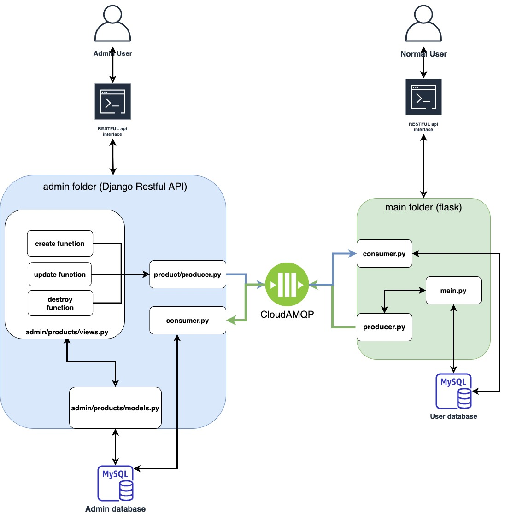
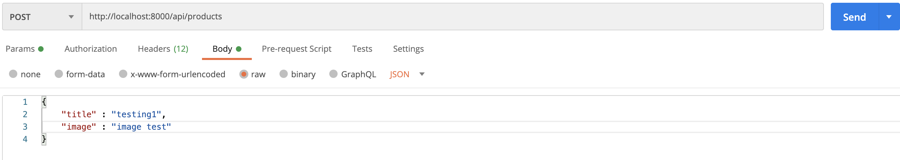
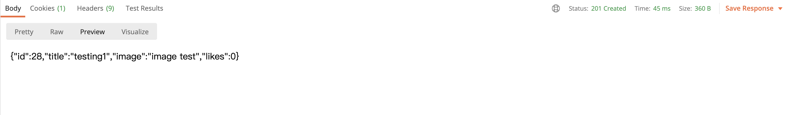
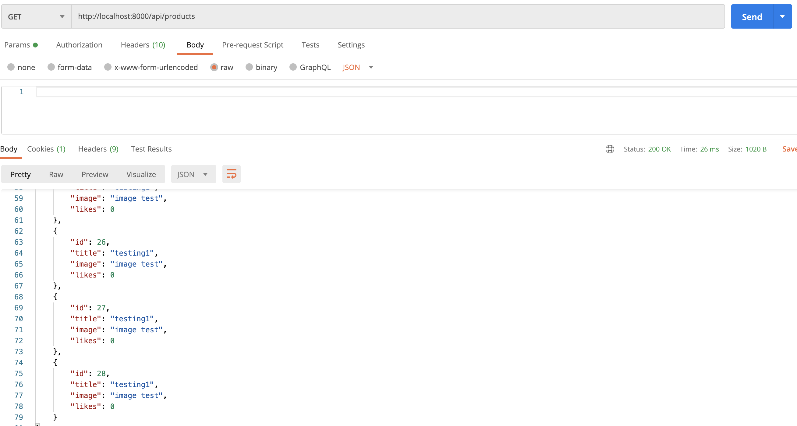
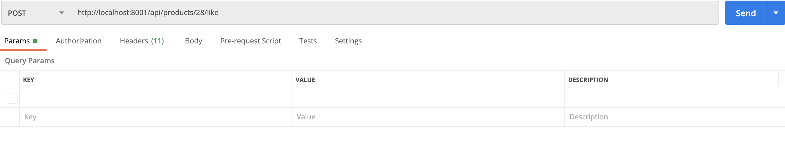
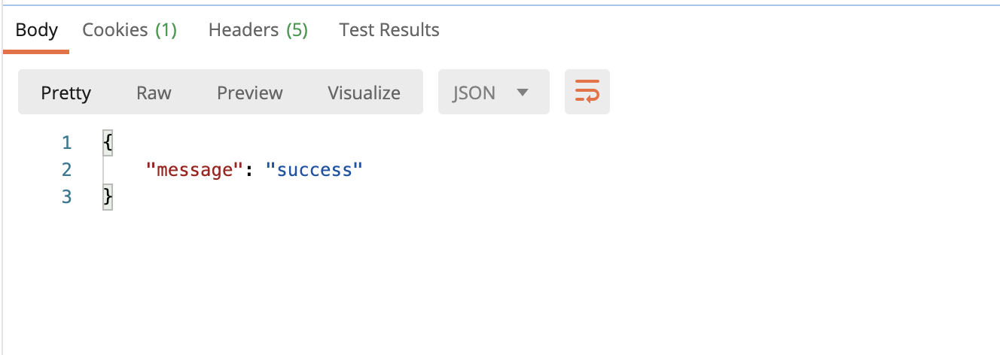

# Python Event Driven Learning

A project that helps me know how to utilize event-driven in any service.

## Project overview
### System Architecture
<div style="width:100%">



</div>

## Technologies
***
A list of technologies used within the project:

* [Django 3.1.3](https://www.djangoproject.com/)
* [Flask](https://flask.palletsprojects.com/)
* [CloudAMQP](https://www.cloudamqp.com/)
* [docker](https://www.docker.com/)
* [docker-compose](https://docs.docker.com/compose/)

#### 
## Usage

### step 1 launch admin service

```
cd admin
docker-compose up --build
```

### step 2 launch main service

```
cd main
docker-compose up --build
```

### step 3 api Testing
#### step 3.0 install postman and Signup a CloudAMQP account
install postman through following link
https://www.postman.com/downloads/

Signup a CloudAMQP account through following link
https://www.cloudamqp.com/

#### step 3.1 update the cloudamqp url to following file
admin/consumer.py
admin/products/producer.py
main/consumer.py
main/producer.py

```
please change URLParamerter to your own url
params = pika.URLParameters('Your CloudAMPQ url')
```

### step 3.2 Create product
* go to post man application
* Type http://localhost:8000/api/products
* Select POST method
* in the body section type json object
<div style="width:100%">



</div>

##### if the post is created will return the following message

<div style="width:100%">



</div>

##### list all the item

* change the method to GET
* Remove the body raw content
* you will see all the item created before
  
<div style="width:100%">



</div>

### step 3.3 Update likes

* change the url to http://localhost:8001/api/products/\<id>\/like
  * enter the exsist id to your url (you can reference the id through previous steps)
* change the method to POST
  
<div style="width:100%">



</div>

##### if the post is created will return the following message

<div style="width:100%">



</div>

### step 3.4 check the Update likes

* change method to GET
* enter the url http://localhost:8000/api/products
* You may findout that the django recieve the flask event and update the likes as well
<div style="width:100%">


</div>